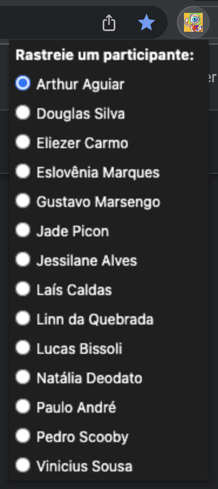

# BBB Tracker

Chrome extension to track participants of Big Brother Brasil through an [API](https://github.com/rrazvd/bbb-face-recognizer)



## Instalation

In the `src` folder create a `config.js` file with API_PATH, like example below.

```
// config.js
export const API_PATH = "http://localhost:8000";
```

And read this [article](https://webkul.com/blog/how-to-install-the-unpacked-extension-in-chrome/) to install the extension on chrome dev mode.

> Make sure that API is working!

## Usage

After successful installation, you must be logged into your Globoplay account and with the [payperview tab](https://globoplay.globo.com/bbb-22-camera-1/ao-vivo/244881/?category=bbb) open.

So, you can open the extension and select the participant to be tracked.

> Your payperview tab will automatically be redirected to the page where your selected participant was tracked.
